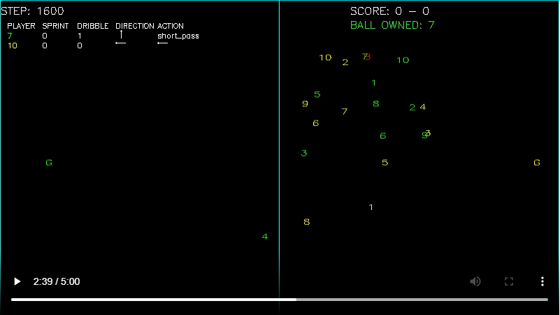
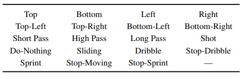

# Google Research Football
## Train agents to master the world's most popular sport

This paper by Google Research describes the environment. Also it provides benchmark results for three stateof-the-art reinforcement learning algorithms. Two of them are popular policy gradient methods (PPO, IMPALA) and one is a modern DQN implementation (Ape-X DQN).

1. PPO (Schulman et al., 2017, https://arxiv.org/pdf/1707.06347.pdf)
1. IMPALA (Espeholt et al., 2018, https://arxiv.org/pdf/1802.01561.pdf)
1. Ape-X DQN (Horgan et al., 2018, https://arxiv.org/pdf/1803.00933.pdf)

The paper by Google Researchby Google Research: https://arxiv.org/pdf/1907.11180.pdf

### Environment
The Football Engine is out of the box compatible with OpenAI Gym API, so any approaches used on OpenAI Gym projects will be useful for this special problem too.

The state representation is described in the paper, but here is a clear explanation as well:
https://towardsdatascience.com/google-football-environment-installation-and-training-rl-agent-using-a3c-d058a44f0fad

One representation we are planning to use is Super Mini Map (SMM) representation. It is visualized by many competitors, here is an example:

### Action set
The environment supports 19 actions listed here:

### Reward function
One very straightforward reward function is the goal score.

### Reinforcement learning
Reinforcement learning articles listed that seems to cover most of the topic:
https://medium.com/@jonathan_hui/rl-deep-reinforcement-learning-series-833319a95530